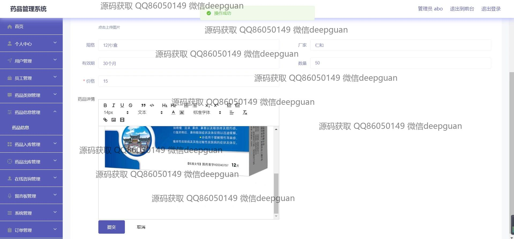
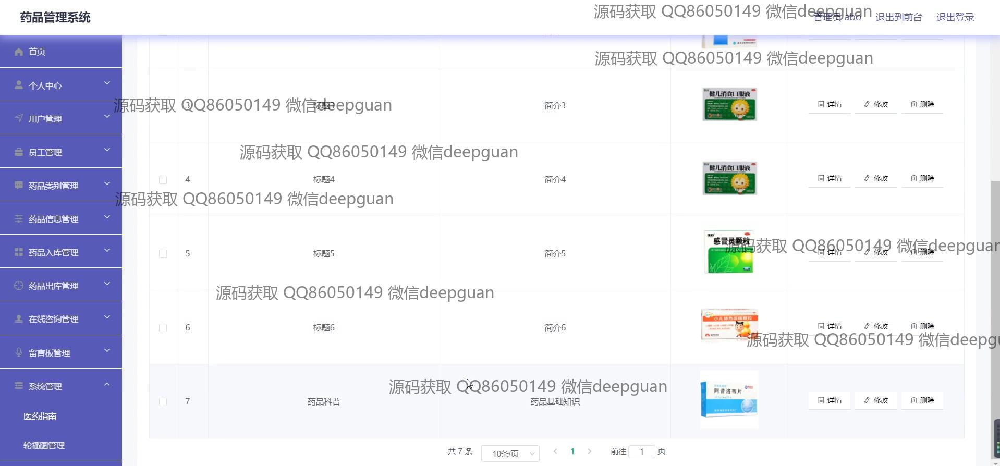
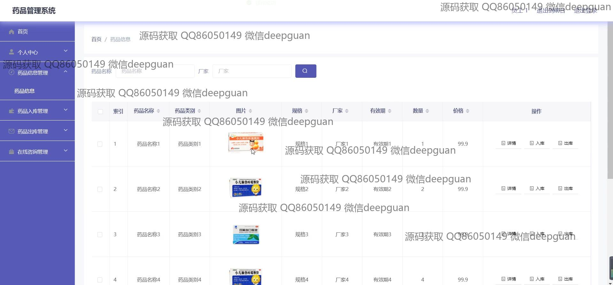

<h1 align="center">的药品商超销售进销存管理系统vue</h1>

## 简介
药品商超销售进销存管理系统：角色分为管理员、用户；药品信息管理、在线咨询、订单管理、库存管理、用户反馈。    --计算机毕业设计源码；毕设源码；java毕业设计源码

## 联系方式

<h3 align="center">获取完整代码与数据库文件 + 微信：deepguan QQ: 86050149 QQ群: 783742310</h3>

<h3 align="center">可帮忙远程部署 包运行成功！提供远程部署、修改代码、设计文档指导、代码讲解等服务！</h3>

## 功能介绍（完整见运行截图）
管理员：主要负责系统管理和配置，包括用户管理、员工管理、药品类别和信息管理等。可以执行药品入库、出库操作，并管理订单、在线咨询审核和留言反馈。管理员能够查看和修改个人信息，处理系统内的各项后台管理任务，确保销售和库存数据的准确性和及时更新。

用户：用户可通过首页导航栏访问药品信息、医药指南和留言反馈模块。可以查看药品的详细信息，并进行在线购买或收藏。用户中心包括个人信息更新、订单查询和余额充值等功能。用户还可以使用在线咨询服务，与系统管理人员进行互动。系统支持通过购物车进行药品的批量购买，并提供订单详情查看及管理的功能。

## 运行截图

本代码来源于网络,仅供学习参考使用!

